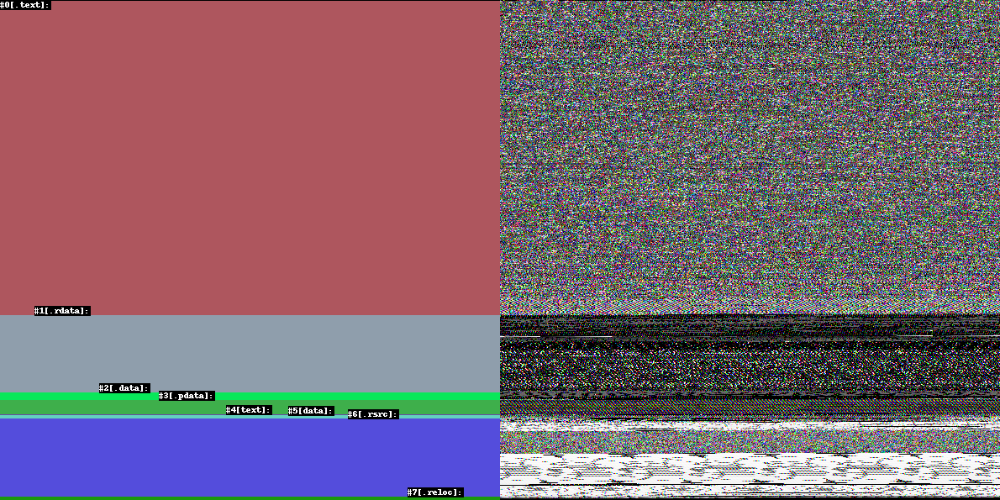
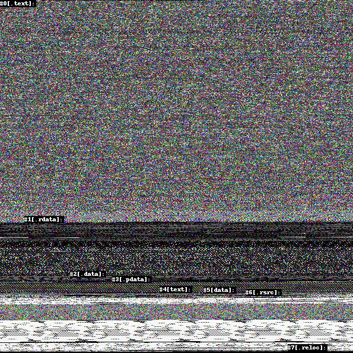

__English__|| [简体中文](./README_zh-CN.md) 
# pe2pic
Small visualizator for PE files

# Getting started 
Install the dependencies by:

```console
pip install -r requirements.txt
```

# Usage

```
usage: pe2pic.py [-h] --infile INFILE [--outfile OUTFILE] [--double]
                 [--minheight MINHEIGHT]

PE visualizer

options:
  -h, --help            show this help message and exit
  --infile INFILE       Input file
  --outfile OUTFILE     Output file
  --double              double section view?
  --minheight MINHEIGHT
                        Min height of the output image

```

# Demo

Double view:



Single view:


